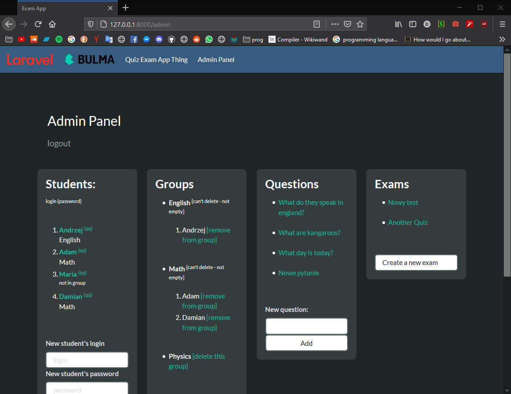
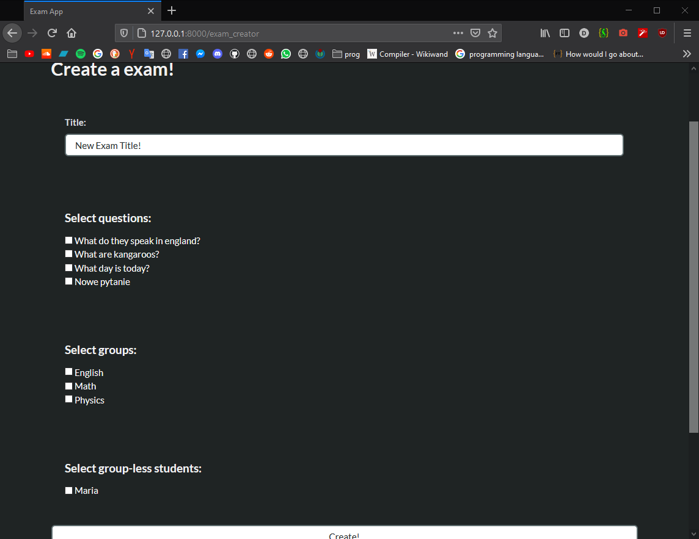
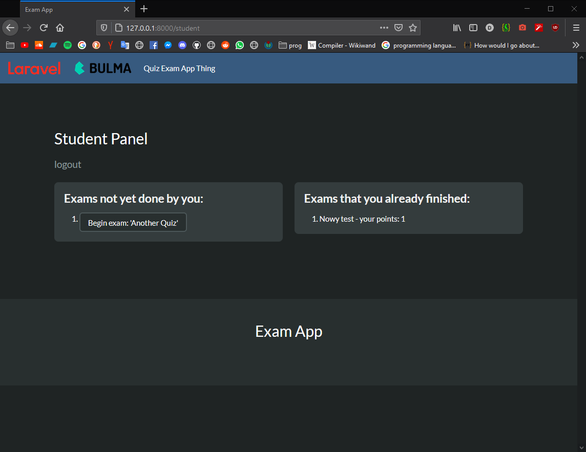

# Project
The goal for this project was to implement a small and simple exam/quiz website,
where the teacher (administrator of the system) could:
- Add, remove, generally manage student accounts
- Assign students to groups (like Math or English class)
- Create questions for the quiz/exam, along with correct and incorrect answers
- Create exams from questions, to which students could be assigned to

Additionally, where a student could:
- Log into, and log out of, his/her account (with sessions implemented of course)
- See the exams that he/she hasn't done yet
- Try to solve these exams, where the order of questions and answers is random
- See the exams that he/she has already solved, and see how many points he/she has got in them

Technical:
- Laravel / MVC (PHP)
- Bulma for CSS styling
- MySQL database

# Media

# Usage/installation
- `composer install` to install the dependencies into `vendor` directory
- set up `mysql`, with a database named `exam-app`
- `php artisan migrate:refresh` to set up the tables and seed them
- `php artisan serve` to run a local server

On the site...
- login for the admin account is `ad`, and `ad` for the password
- login for one of the student accounts is `Maria`, with `qq` for the password

# Etc
License is MIT.
